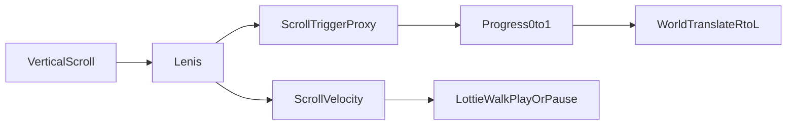
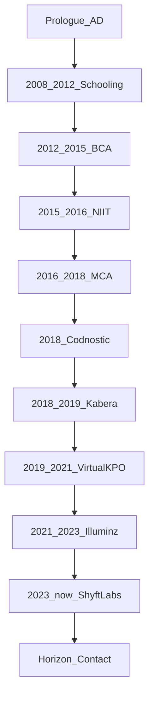

# Life Journey Portfolio — Implementation Plan

Immersive vertical-scroll → horizontal-world storytelling site for **Aditya Dutta (AD.)**. Single continuous journey page — not a multi-section marketing site.

**Defaults locked for build:**
- Greenfield Next.js App Router in this repo (static HTML becomes legacy/reference)
- Brand **AD. / Aditya Dutta**
- **Single page, no navbar**
- **Dark theme always** (no light mode toggle)
- Scene art = **user-provided PNGs** (detailed per-scene brief below)
- Character = **Lottie walk cycle** (free candidate first; user can replace)
- Timeline = **real journey data** below (source of truth in `data/timeline.ts`)

Project copy of this plan: [docs/JOURNEY_PORTFOLIO_PLAN.md](docs/JOURNEY_PORTFOLIO_PLAN.md)

---

## Product constraints

1. **No navbar** — no top nav links, no section menu. Only minimal non-nav HUD: optional `AD.` wordmark, active year label, prologue scroll hint.
2. **Dark theme always** — deep charcoal / near-black base, soft warm accents, high-contrast type. No light theme.
3. **Illustrations = PNGs you provide** — named slots under `public/illustrations/`. Full scene-by-scene context below.
4. **Character = Lottie** — play while scrolling, pause when idle. Free walk cycle from [LottieFiles walking](https://lottiefiles.com/free-animations/walking) / [walk cycle](https://lottiefiles.com/free-animations/walk-cycle), or your own file at `public/illustrations/character/walk.json`.

---

## Core mechanic



- Pin a full-viewport journey shell.
- Map vertical scroll to horizontal world width.
- Character fixed left-middle; environment moves.
- Lottie walk plays only while `|velocity| > threshold`.

---

## Real timeline (source of truth)

| Period | Era id | Title | Detail | Location |
|--------|--------|-------|--------|----------|
| 2008–2012 | `schooling` | Schooling | 10th and 12th | Govt. Senior Secondary School, Nadaun |
| 2012–2015 | `bachelors` | Bachelors | BCA | Govt. Degree College, Hamirpur |
| 2015–2016 | `niit` | NIIT | Java course | NIIT |
| 2016–2018 | `masters` | Masters | MCA | Chandigarh University |
| Feb–Oct 2018 | `internship` | Internship | 6 months | Codnostic Solutions |
| Nov 2018–May 2019 | `kabera` | Junior UI Developer | First job | Kabera Global Pvt. Ltd |
| Jun 2019–Oct 2021 | `virtual-kpo` | Junior UI Developer | — | Virtual KPO Pvt. Ltd |
| Nov 2021–Feb 2023 | `illuminz` | Senior UI Developer | — | Illuminz |
| Feb 2023–present | `shyftlabs` | Senior UI Developer | Current role | ShyftLabs |
| Horizon | `horizon` | What’s next | Contact / CTA | — |

Each row = one horizontal chapter. Road labels show start year (or range). Cards carry full date ranges.

---

## Information architecture

Single route `/` only. No navbar.



---

## Scene art brief — every image you need

**Global art direction**
- Flat / soft-shaded illustration (not photos)
- Designed for **dark backgrounds**; use transparency (no white canvas)
- Same style, horizon line, and character scale across all scenes
- Soft glow accents OK (windows, screens, street lights)
- Export PNG @2x; aim under ~300KB per file (WebP later optional)

**Where files go:** `public/illustrations/...`

---

### A. Shared props (reuse on every chapter)

| File | Context — what to draw |
|------|------------------------|
| `props/cloud-1.png` | Soft dark-sky cloud, muted blue-gray, semi-transparent edges |
| `props/cloud-2.png` | Second cloud shape for variety / parallax |
| `props/tree-1.png` | Foreground tree silhouette or soft-filled tree, readable on dark |
| `props/tree-2.png` | Alternate tree (different height/shape) |
| `props/bird.png` | Simple side-view bird for occasional fly-by |
| `props/street-light.png` | Tall street lamp with warm glowing bulb (career chapters) |
| `props/mountain.png` | Wide distant mountain / hill silhouette for background depth |
| `road/road-segment.png` | Optional tiling asphalt strip with dashed center line (or road is pure CSS) |

---

### B. Prologue

| File | Role | Context — what to draw |
|------|------|------------------------|
| `scenes/prologue/mark.png` | Optional brand mark | Stylized `AD.` monogram or small portrait-free emblem that fits dark UI |
| `scenes/prologue/path-start.png` | Midground | Empty road beginning / trailhead feel — quiet start before school years |

**Mood:** quiet night, invitation to scroll, minimal props.

---

### C. Schooling (2008–2012) — Nadaun

| File | Role | Context — what to draw |
|------|------|------------------------|
| `scenes/schooling/building.png` | Midground hero | Govt. senior secondary school building — Indian school vibe (gate, flagpole, simple block building), night/dusk friendly colors |
| `scenes/schooling/playground.png` | Mid/FG prop | Playground: slide or cricket stumps / basketball hoop — childhood energy |
| `scenes/schooling/bus.png` | Optional prop | Yellow school bus or local Himachal bus silhouette |
| `scenes/schooling/books.png` | Optional FG | Stack of school books / bag |
| `scenes/schooling/card.png` | Milestone card | Compact illustration for the card: school + “10th & 12th” feeling |

**Mood:** small-town Himachal school, warm windows, trees, youthful.

**Card copy hooks:** Govt. Senior Secondary School, Nadaun · 10th & 12th.

---

### D. Bachelors (2012–2015) — BCA, Hamirpur

| File | Role | Context — what to draw |
|------|------|------------------------|
| `scenes/bachelors/college.png` | Midground hero | Govt. degree college building / campus block — more mature than school |
| `scenes/bachelors/campus.png` | Optional prop | Campus path, notice board, or students-as-silhouettes (no faces needed) |
| `scenes/bachelors/laptop-old.png` | Optional FG | Early-2010s laptop / computer lab desk — first serious computing |
| `scenes/bachelors/card.png` | Milestone card | College + BCA motif (degree cap subtle, or college facade) |

**Mood:** college town, first independence, cooler blues mixed with dark base.

**Card copy hooks:** BCA · Govt. Degree College, Hamirpur.

---

### E. NIIT (2015–2016) — Java course

| File | Role | Context — what to draw |
|------|------|------------------------|
| `scenes/niit/classroom.png` | Midground hero | Training classroom / coaching center interior or exterior with glowing screens |
| `scenes/niit/code-board.png` | Optional prop | Whiteboard or monitor showing abstract Java-like code (not real logos if avoidable) |
| `scenes/niit/card.png` | Milestone card | Desk + code + coffee — “learning Java” moment |

**Mood:** focused training year, screen glow as accent light.

**Card copy hooks:** NIIT · Java course.

---

### F. Masters (2016–2018) — MCA, Chandigarh University

| File | Role | Context — what to draw |
|------|------|------------------------|
| `scenes/masters/university.png` | Midground hero | Modern university building / campus landmark feel (Chandigarh University vibe — larger, more contemporary) |
| `scenes/masters/hostel.png` | Optional prop | Hostel block or dorm window lights |
| `scenes/masters/library.png` | Optional prop | Library / study desk with laptop and lamp |
| `scenes/masters/card.png` | Milestone card | University + MCA / graduation-adjacent (keep tasteful, not clipart) |

**Mood:** bigger city campus, ambition, late-night study lights.

**Card copy hooks:** MCA · Chandigarh University.

---

### G. Internship (Feb–Oct 2018) — Codnostic Solutions

| File | Role | Context — what to draw |
|------|------|------------------------|
| `scenes/internship/office.png` | Midground hero | Small startup / agency office — few desks, first professional environment |
| `scenes/internship/desk.png` | Optional FG | First office desk: monitor, notebook, ID badge vibe |
| `scenes/internship/card.png` | Milestone card | “First internship” — office door or desk scene |

**Mood:** nervous excitement, first real workplace, softer city lights starting.

**Card copy hooks:** Codnostic Solutions · Feb–Oct 2018 · 6 months.

---

### H. Kabera Global (Nov 2018–May 2019) — Junior UI Developer

| File | Role | Context — what to draw |
|------|------|------------------------|
| `scenes/kabera/office.png` | Midground hero | Corporate / product office exterior or open desk floor |
| `scenes/kabera/ui-desk.png` | Optional FG | UI designer desk: large monitor with wireframe/UI shapes, pen tablet optional |
| `scenes/kabera/card.png` | Milestone card | Junior UI role — design tools abstract shapes (rectangles, artboards), not brand logos |

**Mood:** first job title, craft beginning, warmer interior light.

**Card copy hooks:** Junior UI Developer · Kabera Global Pvt. Ltd · Nov 2018–May 2019.

---

### I. Virtual KPO (Jun 2019–Oct 2021) — Junior UI Developer

| File | Role | Context — what to draw |
|------|------|------------------------|
| `scenes/virtual-kpo/office.png` | Midground hero | Office or hybrid/remote desk setup — slightly more polished than Kabera |
| `scenes/virtual-kpo/screens.png` | Optional prop | Dual monitors / browser + design tool abstract UI |
| `scenes/virtual-kpo/card.png` | Milestone card | Growth as junior UI — longer tenure energy |

**Mood:** consistency, skill building, mid-career junior years.

**Card copy hooks:** Junior UI Developer · Virtual KPO Pvt. Ltd · Jun 2019–Oct 2021.

---

### J. Illuminz (Nov 2021–Feb 2023) — Senior UI Developer

| File | Role | Context — what to draw |
|------|------|------------------------|
| `scenes/illuminz/office.png` | Midground hero | Modern product studio / tech office — cleaner architecture, more glass/light |
| `scenes/illuminz/team.png` | Optional prop | Abstract team silhouettes at desks (no real faces) |
| `scenes/illuminz/card.png` | Milestone card | Senior step-up — refined UI mock on screen, confident composition |

**Mood:** promotion energy, sharper city skyline beginning behind building.

**Card copy hooks:** Senior UI Developer · Illuminz · Nov 2021–Feb 2023.

---

### K. ShyftLabs (Feb 2023–present) — Senior UI Developer

| File | Role | Context — what to draw |
|------|------|------------------------|
| `scenes/shyftlabs/office.png` | Midground hero | Current workplace — modern, premium product company feel |
| `scenes/shyftlabs/product-ui.png` | Optional FG | Polished product UI on a large display (abstract, no confidential real product) |
| `scenes/shyftlabs/skyline.png` | Optional BG | Soft city skyline behind office |
| `scenes/shyftlabs/card.png` | Milestone card | “Present” chapter — strongest, cleanest illustration in the set |

**Mood:** present day, confident, cinematic; strongest lighting/detail.

**Card copy hooks:** Senior UI Developer · ShyftLabs · Feb 2023–present.

---

### L. Horizon (finale)

| File | Role | Context — what to draw |
|------|------|------------------------|
| `scenes/horizon/skyline.png` | Midground / BG | Future-facing skyline or open road vanishing into stars |
| `scenes/horizon/rocket-or-path.png` | Optional prop | Subtle future motif (path forward / soft rocket / constellation) — elegant, not childish |
| `scenes/horizon/card.png` | CTA card | Invitation visual for contact / “let’s build together” |

**Mood:** hopeful night sky, stars, open ending.

---

### M. Character (Lottie — not PNG)

| File | Context |
|------|---------|
| `character/walk.json` (or `.lottie`) | Side-view continuous walk cycle, readable on dark BG (light clothing / outline). Free from LottieFiles or your custom file. |

---

### Priority order if you cannot deliver everything at once

1. **Must-have midground heroes:** `schooling/building`, `bachelors/college`, `niit/classroom`, `masters/university`, `internship/office`, `kabera/office`, `virtual-kpo/office`, `illuminz/office`, `shyftlabs/office`, `horizon/skyline`
2. **Must-have cards:** one `card.png` per chapter above
3. **Shared props:** clouds, trees, mountain
4. **Nice-to-have:** bus, hostel, library, dual screens, team silhouettes, rocket

---

## Scroll and GSAP architecture

**Master (scrubbed, pinned):** `world.x: 0 → -totalWidth`.

**Parallax:** FG 1.15–1.3x · Road/years 1.0x · Mid 0.55–0.7x · BG 0.2–0.35x.

**Per-chapter triggers:** chapter center crosses character line → enlarge year label, fade neighbors, reveal chapter PNGs.

**Per-milestone triggers:** open `MilestoneCard` via Framer Motion.

**Ambient:** clouds, light glow, stars — dark-sky tuned.

**Reduced motion:** stacked vertical timeline + static Lottie frame.

**Mobile:** same mechanic, shorter chapters, max 2 parallax layers, bottom-sheet cards.

---

## Folder structure

```
app/layout.tsx, page.tsx, globals.css
components/journey/    # JourneyShell, Road, Character (Lottie), ParallaxLayer, SkySystem
components/milestones/ # MilestoneMarker, MilestoneCard
components/ui/         # YearHUD (no nav), ReducedMotionFallback, ScrollHint
sections/              # Prologue + data-driven chapters
timeline/              # SceneChapter, YearStrip
animations/gsap/       # setupLenis, masterTimeline, parallax, chapterFocus
animations/framer/
hooks/                 # useScrollVelocity, usePrefersReducedMotion, useActiveChapter
constants/             # parallaxSpeeds, breakpoints, colors (dark tokens)
data/timeline.ts, eras.ts
types/timeline.ts
public/illustrations/
  character/walk.json
  props/
  road/
  scenes/{prologue,schooling,bachelors,niit,masters,internship,kabera,virtual-kpo,illuminz,shyftlabs,horizon}/
docs/JOURNEY_PORTFOLIO_PLAN.md
```

---

## Key components

- `JourneyShell` — pin, providers; **no navbar**
- `SmoothScrollProvider` — Lenis ↔ ScrollTrigger
- `SceneChapter` — chapter from timeline data + PNG slots
- `Character` + `WalkController` — Lottie + velocity gate
- `Road` + `YearStrip`
- `MilestoneCard` — PNG, title, description, location, date range, org
- `YearHUD` — `AD.` + active year only
- `ContactFinale` — Horizon CTA + CV

---

## Visual system (dark)

- Base near-black / deep charcoal; elevated surfaces slightly lighter
- Accents: warm amber/coral for milestones; cool blue for education; muted teal for career
- Type: expressive display + clean body; high contrast
- Brand lockup: **AD.** (wordmark) / **Aditya Dutta** (full name in prologue + finale)
- No light-mode stylesheet

---

## Data model

```ts
type Milestone = {
  id: string;
  chapterId: string;
  title: string;
  description: string;
  location?: string;
  organization?: string;
  dateLabel: string;
  illustration: string;
  kind: "milestone" | "atmosphere" | "cta";
};

type ChapterScene = {
  id: string;
  startYear: number;
  endYear: number | "present";
  era: "education" | "training" | "career" | "horizon";
  label: string;
  palette: string;
  props: { layer: "fg" | "mid" | "bg"; src: string }[];
  milestones: string[];
};
```

---

## Development phases

1. **Scaffold** — Next.js + TS + Tailwind dark-only; Lenis↔ScrollTrigger; empty world; no navbar; brand AD.
2. **Core loop** — Road, year strip, Lottie character + velocity play/pause
3. **Data + first chapters** — Real timeline; `SceneChapter` + PNG slots; schooling → masters
4. **World** — Career chapters through ShyftLabs, parallax, ambient, chapter focus
5. **Product UI** — Cards, YearHUD, prologue/horizon, mobile, a11y
6. **Ship** — Lazy PNGs, 60fps pass, final assets, launch

---

## Out of scope for v1

- Navbar / multi-page primary nav
- Light theme / theme toggle
- Real photography
- Multi-page case-study site

---

## Success criteria

- Single-page journey branded **AD. / Aditya Dutta**, no navbar
- Always dark; readable contrast
- Continuous cinematic scroll; Lottie walks only while scrolling
- Timeline matches the real journey table
- PNGs plug in via documented paths; each scene has clear art context
- Reduced-motion usable; mobile redesigned
- ~60fps with lazy chapter mounting
